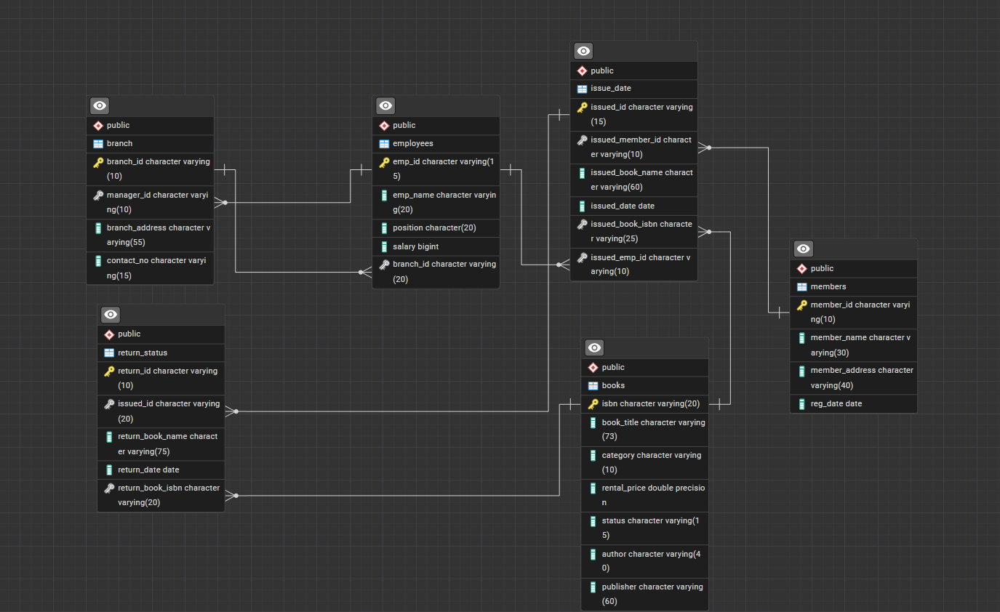

# 📚 Library Management System - Advanced SQL Project

<div align="center">


**A comprehensive database management system for library operations built with PostgreSQL**

[Features](#-features) • [Installation](#-installation--setup) • [Database Schema](#-database-schema) • [Queries](#-project-tasks--sql-queries) • [Documentation](#-documentation)

</div>

---

## 📋 Table of Contents

- [Project Overview](#-project-overview)
- [Features](#-features)
- [Technologies Used](#️-technologies-used)
- [Database Schema](#-database-schema)
- [Installation & Setup](#-installation--setup)
- [Project Structure](#-project-structure)
- [Project Tasks & SQL Queries](#-project-tasks--sql-queries)
  - [Basic CRUD Operations](#basic-crud-operations-tasks-1-5)
  - [Advanced Queries](#advanced-queries-tasks-6-12)
  - [Complex Operations](#complex-operations-tasks-13-19)
- [Advanced Features](#-advanced-features)
- [Sample Queries](#-sample-queries)
- [Performance Optimization](#-performance-optimization)
- [Learning Outcomes](#-learning-outcomes)
- [Future Enhancements](#-future-enhancements)
- [Contributing](#-contributing)
- [License](#-license)
- [Author](#-author)
- [Acknowledgments](#-acknowledgments)

---

## 🎯 Project Overview

This **Library Management System** is an intermediate-level SQL project that demonstrates comprehensive database design, management, and querying skills using **PostgreSQL**. The system efficiently handles library operations including book inventory management, member registrations, book borrowing/returning, employee management, and multi-branch operations.

### Project Metrics
- **Level**: Intermediate to Advanced
- **Database**: PostgreSQL 18+
- **Tables**: 6 core tables with full referential integrity
- **Tasks Completed**: 19 comprehensive SQL tasks
- **Lines of SQL**: 500+ lines of optimized queries
- **Procedures**: 2 stored procedures
- **Triggers**: 1 automated trigger

---

## ✨ Features

<table>
<tr>
<td width="50%">

### Core Functionality
- ✅ **Book Inventory Management**
  - Add, update, delete books
  - Track availability status
  - Categorize and price books
  
- ✅ **Member Management**
  - Register new members
  - Update member information
  - Track member activity
  - Identify active/inactive members

- ✅ **Issue & Return System**
  - Issue books to members
  - Track issue dates
  - Process book returns
  - Automated status updates

</td>
<td width="50%">

### Advanced Features
- ✅ **Employee Management**
  - Manage employee records
  - Assign employees to branches
  - Track performance metrics
  
- ✅ **Branch Operations**
  - Multi-branch support
  - Branch manager assignments
  - Performance reporting

- ✅ **Analytics & Reporting**
  - Revenue analysis by category
  - Overdue book tracking
  - High-risk borrower identification
  - Branch performance reports

</td>
</tr>
</table>

---

## 🛠️ Technologies Used

| Technology | Purpose | Version |
|------------|---------|---------|
| **PostgreSQL** | Primary Database | 18+ |
| **pgAdmin** | Database Management | 4.x |
| **SQL (plpgsql)** | Stored Procedures & Functions | - |
| **Git** | Version Control | Latest |
| **Markdown** | Documentation | - |

---

## 📊 Database Schema

### Entity Relationship Diagram



### Tables Overview

<details>
<summary><b>📖 Books Table</b> (Click to expand)</summary>

```sql
CREATE TABLE books (
    isbn VARCHAR(20) PRIMARY KEY,
    book_title VARCHAR(73),
    category VARCHAR(50),
    rental_price NUMERIC(10, 2),
    status VARCHAR(15),
    author VARCHAR(40),
    publisher VARCHAR(60)
);
```

**Purpose**: Stores complete book inventory information including pricing and availability.

</details>

<details>
<summary><b>👥 Members Table</b></summary>

```sql
CREATE TABLE members (
    member_id VARCHAR(10) PRIMARY KEY,
    member_name VARCHAR(30),
    member_address VARCHAR(40),
    reg_date DATE
);
```

**Purpose**: Maintains member registration details and history.

</details>

<details>
<summary><b>👨‍💼 Employees Table</b></summary>

```sql
CREATE TABLE employees (
    emp_id VARCHAR(15) PRIMARY KEY,
    emp_name VARCHAR(20),
    position CHAR(20),
    salary NUMERIC(10, 2),
    branch_id VARCHAR(20),
    FOREIGN KEY (branch_id) REFERENCES branch(branch_id)
);
```

**Purpose**: Manages employee information and branch assignments.

</details>

<details>
<summary><b>🏢 Branch Table</b></summary>

```sql
CREATE TABLE branch (
    branch_id VARCHAR(10) PRIMARY KEY,
    manager_id VARCHAR(10),
    branch_address VARCHAR(55),
    contact_no VARCHAR(15),
    FOREIGN KEY (manager_id) REFERENCES employees(emp_id)
);
```

**Purpose**: Stores branch locations and management details.

</details>

<details>
<summary><b>📤 Issue_date Table</b></summary>

```sql
CREATE TABLE issue_date (
    issued_id VARCHAR(15) PRIMARY KEY,
    issued_member_id VARCHAR(10),
    issued_book_name VARCHAR(60),
    issued_date DATE,
    issued_book_isbn VARCHAR(25),
    issued_emp_id VARCHAR(10),
    FOREIGN KEY (issued_member_id) REFERENCES members(member_id),
    FOREIGN KEY (issued_book_isbn) REFERENCES books(isbn),
    FOREIGN KEY (issued_emp_id) REFERENCES employees(emp_id)
);
```

**Purpose**: Tracks all book borrowing transactions.

</details>

<details>
<summary><b>📥 Return_status Table</b></summary>

```sql
CREATE TABLE return_status (
    return_id VARCHAR(10) PRIMARY KEY,
    issued_id VARCHAR(20),
    return_book_name VARCHAR(75),
    return_date DATE,
    return_book_isbn VARCHAR(20),
    book_quality VARCHAR(15),
    FOREIGN KEY (issued_id) REFERENCES issue_date(issued_id),
    FOREIGN KEY (return_book_isbn) REFERENCES books(isbn)
);
```

**Purpose**: Records book returns and condition assessment.

</details>

---

## 📥 Installation & Setup

### Prerequisites

- **PostgreSQL** (version 13 or higher)
- **pgAdmin 4** or any PostgreSQL client
- **Git** (for cloning the repository)

### Step-by-Step Installation

#### 1️⃣ Clone the Repository

```bash
git clone https://github.com/YOUR_USERNAME/Library-Management-System.git
cd Library-Management-System
```

#### 2️⃣ Create the Database

```sql
CREATE DATABASE library_project;
```

#### 3️⃣ Execute Schema File

```bash
# Using psql command line
psql -U postgres -d library_project -f database/schema.sql

# OR using pgAdmin:
# 1. Open pgAdmin
# 2. Connect to your PostgreSQL server
# 3. Right-click on library_project database
# 4. Select Query Tool
# 5. Open and execute schema.sql
```

#### 4️⃣ Import Sample Data (Optional)

```bash
# If you have CSV files
psql -U postgres -d library_project -c "\COPY books FROM 'data/books.csv' CSV HEADER"
psql -U postgres -d library_project -c "\COPY members FROM 'data/members.csv' CSV HEADER"
# ... repeat for other tables
```

#### 5️⃣ Verify Installation

```sql
-- Check if all tables are created
SELECT table_name 
FROM information_schema.tables 
WHERE table_schema = 'public';

-- Verify foreign key constraints
SELECT
    tc.table_name, 
    kcu.column_name, 
    ccu.table_name AS foreign_table_name
FROM information_schema.table_constraints AS tc 
JOIN information_schema.key_column_usage AS kcu
    ON tc.constraint_name = kcu.constraint_name
JOIN information_schema.constraint_column_usage AS ccu
    ON ccu.constraint_name = tc.constraint_name
WHERE tc.constraint_type = 'FOREIGN KEY';
```

---

## 📁 Project Structure

```
Library-Management-System/
│
├── 📄 README.md                          # Main documentation
├── 📄 LICENSE                            # MIT License
├── 📄 .gitignore                         # Git ignore rules
│
├── 📂 database/
│   ├── 📄 schema.sql                    # Database schema creation
│   ├── 📄 queries.sql                   # All project tasks (Task 1-19)
│   └── 📄 sample_data.sql               # Sample data insertion
│
├── 📂 docs/
│   ├── 🖼️ ER_Diagram.png                # Entity Relationship Diagram
│   ├── 📄 Project_Requirements.md        # Detailed requirements
│   ├── 📄 Database_Documentation.md      # Table structures & relationships
│   └── 📄 Query_Explanations.md          # Detailed query explanations
│
├── 📂 procedures/
│   ├── 📄 issue_book.sql                # Book issuing procedure
│   └── 📄 add_return_records.sql        # Book return procedure
│
├── 📂 triggers/
│   └── 📄 update_book_status.sql        # Auto-update book status trigger
│
└── 📂 reports/
    ├── 📄 branch_performance.sql         # Branch performance queries
    ├── 📄 overdue_books.sql              # Overdue books report
    └── 📄 revenue_analysis.sql           # Revenue analysis queries
```

---

## 📝 Project Tasks & SQL Queries

### Basic CRUD Operations (Tasks 1-5)

<details>
<summary><b>Task 1: Create a New Book Record</b></summary>

```sql
INSERT INTO books(isbn, book_title, category, rental_price, status, author, publisher)
VALUES ('978-1-60129-456-2', 'To Kill a Mockingbird', 'Classic', 6.00, 'yes', 'Harper Lee', 'J.B. Lippincott & Co.');
```

**Purpose**: Demonstrates INSERT operation for adding new books to inventory.

</details>

<details>
<summary><b>Task 2: Update an Existing Member's Address</b></summary>

```sql
UPDATE members
SET member_address = '125 Main St'
WHERE member_id = 'C101';
```

**Purpose**: Shows UPDATE operation for modifying member information.

</details>

<details>
<summary><b>Task 3: Delete a Record from Issue Table</b></summary>

```sql
DELETE FROM issue_date
WHERE issued_id = 'IS121';
```

**Purpose**: Illustrates DELETE operation with WHERE clause.

</details>

<details>
<summary><b>Task 4: Retrieve All Books Issued by Employee</b></summary>

```sql
SELECT * 
FROM issue_date
WHERE issued_emp_id = 'E101';
```

**Purpose**: Basic SELECT with filtering.

</details>

<details>
<summary><b>Task 5: List Members Who Issued Multiple Books</b></summary>

```sql
SELECT 
    issued_member_id,
    COUNT(*) AS books_issued
FROM issue_date
GROUP BY issued_member_id
HAVING COUNT(*) > 1;
```

**Purpose**: Demonstrates GROUP BY and HAVING clauses for aggregation.

</details>

### Advanced Queries (Tasks 6-12)

<details>
<summary><b>Task 6: Create Summary Table using CTAS</b></summary>

```sql
CREATE TABLE book_issued_summary AS
SELECT 
    b.isbn,
    b.book_title,
    COUNT(i.issued_id) AS issue_count
FROM books b
LEFT JOIN issue_date i ON b.isbn = i.issued_book_isbn
GROUP BY b.isbn, b.book_title
ORDER BY issue_count DESC;
```

**Purpose**: Create Table As Select (CTAS) for reporting.

</details>

<details>
<summary><b>Task 7: Retrieve Books by Category</b></summary>

```sql
SELECT * 
FROM books
WHERE category = 'Classic'
ORDER BY book_title;
```

</details>

<details>
<summary><b>Task 8: Calculate Total Rental Income by Category</b></summary>

```sql
SELECT 
    b.category,
    COUNT(i.issued_id) AS total_issues,
    SUM(b.rental_price) AS total_revenue,
    ROUND(AVG(b.rental_price), 2) AS avg_rental_price
FROM books b
INNER JOIN issue_date i ON b.isbn = i.issued_book_isbn
GROUP BY b.category
ORDER BY total_revenue DESC;
```

**Purpose**: Financial analysis with aggregation functions.

</details>

<details>
<summary><b>Task 9: List Recent Member Registrations (180 days)</b></summary>

```sql
SELECT 
    member_id,
    member_name,
    reg_date,
    CURRENT_DATE - reg_date AS days_since_registration
FROM members
WHERE reg_date >= CURRENT_DATE - INTERVAL '180 days'
ORDER BY reg_date DESC;
```

**Purpose**: Date filtering with interval arithmetic.

</details>

<details>
<summary><b>Task 10: Employee-Manager-Branch Details</b></summary>

```sql
SELECT 
    e.emp_id,
    e.emp_name,
    e.position,
    e.salary,
    b.branch_id,
    b.branch_address,
    m.emp_name AS manager_name
FROM employees e
JOIN branch b ON e.branch_id = b.branch_id
LEFT JOIN employees m ON b.manager_id = m.emp_id
ORDER BY b.branch_id, e.emp_name;
```

**Purpose**: Self-join to show employee-manager relationships.

</details>

<details>
<summary><b>Task 11: Create High-Value Books Table</b></summary>

```sql
CREATE TABLE expensive_books AS
SELECT * 
FROM books
WHERE rental_price > 7.00
ORDER BY rental_price DESC;
```

</details>

<details>
<summary><b>Task 12: Identify Unreturned Books</b></summary>

```sql
SELECT 
    i.issued_id,
    i.issued_book_name,
    i.issued_date,
    m.member_name,
    m.member_id,
    CURRENT_DATE - i.issued_date AS days_issued
FROM issue_date i
LEFT JOIN return_status r ON i.issued_id = r.issued_id
JOIN members m ON i.issued_member_id = m.member_id
WHERE r.return_id IS NULL
ORDER BY days_issued DESC;
```

**Purpose**: LEFT JOIN to find missing return records.

</details>

### Complex Operations (Tasks 13-19)

<details>
<summary><b>Task 13: Identify Overdue Books (30+ days)</b></summary>

```sql
SELECT 
    i.issued_member_id,
    m.member_name,
    b.book_title,
    i.issued_date,
    CURRENT_DATE - i.issued_date AS days_overdue,
    (CURRENT_DATE - i.issued_date - 30) * 0.50 AS fine_amount
FROM issue_date i
JOIN members m ON i.issued_member_id = m.member_id
JOIN books b ON i.issued_book_isbn = b.isbn
LEFT JOIN return_status r ON i.issued_id = r.issued_id
WHERE r.return_id IS NULL 
  AND (CURRENT_DATE - i.issued_date) > 30
ORDER BY days_overdue DESC;
```

**Purpose**: Complex filtering with calculated fields (fine calculation).

</details>

<details>
<summary><b>Task 14: Automated Book Return Processing (Stored Procedure)</b></summary>

```sql
CREATE OR REPLACE PROCEDURE add_return_records(
    p_return_id VARCHAR(10), 
    p_issued_id VARCHAR(10), 
    p_book_quality VARCHAR(50)
)
LANGUAGE plpgsql
AS $$
DECLARE 
    v_isbn VARCHAR(50);
    v_book_name VARCHAR(80);
BEGIN 
    -- Get book details
    SELECT issued_book_isbn, issued_book_name
    INTO v_isbn, v_book_name
    FROM issue_date
    WHERE issued_id = p_issued_id;
    
    -- Insert return record
    INSERT INTO return_status(return_id, issued_id, return_date, return_book_name, return_book_isbn, book_quality)
    VALUES (p_return_id, p_issued_id, CURRENT_DATE, v_book_name, v_isbn, p_book_quality);
    
    -- Update book status to available
    UPDATE books
    SET status = 'yes'
    WHERE isbn = v_isbn;
    
    RAISE NOTICE 'Book "%" returned successfully!', v_book_name;
END;
$$;

-- Usage
CALL add_return_records('RS999', 'IS106', 'Good');
```

**Purpose**: Stored procedure for automated book return workflow.

</details>

<details>
<summary><b>Task 15: Branch Performance Report</b></summary>

```sql
CREATE TABLE branch_performance_report AS
SELECT 
    b.branch_id,
    b.branch_address,
    b.manager_id,
    m.emp_name AS manager_name,
    COUNT(DISTINCT e.emp_id) AS total_employees,
    COUNT(i.issued_id) AS total_books_issued,
    COUNT(r.return_id) AS total_books_returned,
    COUNT(i.issued_id) - COUNT(r.return_id) AS books_not_returned,
    SUM(bk.rental_price) AS total_revenue,
    ROUND(AVG(bk.rental_price), 2) AS avg_book_price
FROM branch b
LEFT JOIN employees e ON b.branch_id = e.branch_id
LEFT JOIN employees m ON b.manager_id = m.emp_id
LEFT JOIN issue_date i ON e.emp_id = i.issued_emp_id
LEFT JOIN return_status r ON i.issued_id = r.issued_id
LEFT JOIN books bk ON i.issued_book_isbn = bk.isbn
GROUP BY b.branch_id, b.branch_address, b.manager_id, m.emp_name
ORDER BY total_revenue DESC;
```

**Purpose**: Comprehensive branch analytics with multiple metrics.

</details>

<details>
<summary><b>Task 16: Active Members Analysis (Last 2 Months)</b></summary>

```sql
CREATE TABLE active_members AS
SELECT DISTINCT
    m.member_id,
    m.member_name,
    m.member_address,
    m.reg_date,
    COUNT(i.issued_id) AS books_issued_recently
FROM members m
JOIN issue_date i ON m.member_id = i.issued_member_id
WHERE i.issued_date >= CURRENT_DATE - INTERVAL '2 months'
GROUP BY m.member_id, m.member_name, m.member_address, m.reg_date
ORDER BY books_issued_recently DESC;
```

**Purpose**: Identify active members for retention analysis.

</details>

<details>
<summary><b>Task 17: Top 3 Performing Employees</b></summary>

```sql
SELECT 
    e.emp_id,
    e.emp_name,
    e.position,
    b.branch_id,
    b.branch_address,
    COUNT(i.issued_id) AS books_processed
FROM employees e
JOIN issue_date i ON e.emp_id = i.issued_emp_id
JOIN branch b ON e.branch_id = b.branch_id
GROUP BY e.emp_id, e.emp_name, e.position, b.branch_id, b.branch_address
ORDER BY books_processed DESC
LIMIT 3;
```

**Purpose**: Employee performance ranking.

</details>

<details>
<summary><b>Task 18: High-Risk Borrowers Identification</b></summary>

```sql
SELECT 
    m.member_id,
    m.member_name,
    COUNT(i.issued_id) AS total_books_issued,
    'High Risk' AS risk_status
FROM members m
JOIN issue_date i ON m.member_id = i.issued_member_id
GROUP BY m.member_id, m.member_name
HAVING COUNT(i.issued_id) > 2
ORDER BY total_books_issued DESC;
```

**Purpose**: Risk assessment for library management.

</details>

<details>
<summary><b>Task 19: Book Issuing System (Stored Procedure)</b></summary>

```sql
CREATE OR REPLACE PROCEDURE issue_book(
    p_issued_id VARCHAR(15),
    p_issued_member_id VARCHAR(30),
    p_issued_book_isbn VARCHAR(50),
    p_issued_emp_id VARCHAR(20)
)
LANGUAGE plpgsql
AS $$
DECLARE
    v_status VARCHAR(10);
    v_book_name VARCHAR(80);
BEGIN
    -- Check book availability
    SELECT status, book_title
    INTO v_status, v_book_name
    FROM books
    WHERE isbn = p_issued_book_isbn;
    
    -- Validate book exists
    IF v_status IS NULL THEN
        RAISE EXCEPTION 'Book with ISBN % does not exist', p_issued_book_isbn;
    END IF;
    
    -- Check if available
    IF v_status = 'yes' THEN 
        -- Issue the book
        INSERT INTO issue_date(issued_id, issued_member_id, issued_book_name, issued_date, issued_book_isbn, issued_emp_id)
        VALUES (p_issued_id, p_issued_member_id, v_book_name, CURRENT_DATE, p_issued_book_isbn, p_issued_emp_id);
        
        -- Update status to unavailable
        UPDATE books
        SET status = 'no'
        WHERE isbn = p_issued_book_isbn;
        
        RAISE NOTICE 'Book "%" issued successfully to member %', v_book_name, p_issued_member_id;
    ELSE
        RAISE EXCEPTION 'Book "%" is currently unavailable', v_book_name;
    END IF;
END;
$$;

-- Usage
CALL issue_book('IS1500', 'C101', '978-0-330-25864-8', 'E104');
```

**Purpose**: Complete book issuing workflow with validation.

</details>

---

## 🚀 Advanced Features

### Triggers

#### Auto-Update Book Status on Return

```sql
CREATE OR REPLACE FUNCTION update_book_status()
RETURNS TRIGGER
LANGUAGE plpgsql
AS $$
BEGIN
    UPDATE books
    SET status = 'yes'
    WHERE isbn = NEW.return_book_isbn;
    
    RAISE NOTICE 'Book % status updated to available', NEW.return_book_name;
    RETURN NEW;
END;
$$;

CREATE TRIGGER trigger_update_book_status
AFTER INSERT ON return_status
FOR EACH ROW
EXECUTE FUNCTION update_book_status();
```

---

## 📊 Sample Queries

### Find Most Popular Books

```sql
SELECT 
    b.book_title,
    b.author,
    b.category,
    COUNT(i.issued_id) AS times_issued
FROM books b
LEFT JOIN issue_date i ON b.isbn = i.issued_book_isbn
GROUP BY b.isbn, b.book_title, b.author, b.category
ORDER BY times_issued DESC
LIMIT 10;
```

### Calculate Member Lifetime Value

```sql
SELECT 
    m.member_id,
    m.member_name,
    COUNT(i.issued_id) AS total_books_borrowed,
    SUM(b.rental_price) AS total_spent,
    ROUND(AVG(b.rental_price), 2) AS avg_spend_per_book
FROM members m
JOIN issue_date i ON m.member_id = i.issued_member_id
JOIN books b ON i.issued_book_isbn = b.isbn
GROUP BY m.member_id, m.member_name
ORDER BY total_spent DESC;
```

### Books Never Issued

```sql
SELECT 
    b.isbn,
    b.book_title,
    b.author,
    b.category,
    b.rental_price
FROM books b
LEFT JOIN issue_date i ON b.isbn = i.issued_book_isbn
WHERE i.issued_id IS NULL
ORDER BY b.book_title;
```

---

## ⚡ Performance Optimization

### Indexes

```sql
-- Index on frequently queried columns
CREATE INDEX idx_issue_date_member ON issue_date(issued_member_id);
CREATE INDEX idx_issue_date_book ON issue_date(issued_book_isbn);
CREATE INDEX idx_issue_date_date ON issue_date(issued_date);
CREATE INDEX idx_books_status ON books(status);
CREATE INDEX idx_members_reg_date ON members(reg_date);

-- Composite indexes for common queries
CREATE INDEX idx_issue_member_date ON issue_date(issued_member_id, issued_date);
```

### Query Optimization Tips

1. **Use EXPLAIN ANALYZE** to check query performance
2. **Avoid SELECT \*** in production - specify columns
3. **Use appropriate JOIN types** (INNER vs LEFT)
4. **Add WHERE clauses** before JOIN when possible
5. **Use LIMIT** for large result sets

---

## 🎓 Learning Outcomes

By completing this project, you'll gain proficiency in:

- ✅ **Database Design**: Normalization, relationships, constraints
- ✅ **SQL Fundamentals**: SELECT, INSERT, UPDATE, DELETE
- ✅ **Advanced SQL**: JOINs, subqueries, CTEs, window functions
- ✅ **Aggregation**: GROUP BY, HAVING, aggregate functions
- ✅ **Stored Procedures**: plpgsql programming
- ✅ **Triggers**: Automated database actions
- ✅ **Data Analysis**: Complex analytical queries
- ✅ **Performance**: Indexing and query optimization
- ✅ **Best Practices**: Code organization, documentation

---

## 🔮 Future Enhancements

- [ ] **Fine Calculation System**: Automated overdue fine calculation and tracking
- [ ] **Book Reservation**: Allow members to reserve currently issued books
- [ ] **Email Notifications**: Send alerts for due dates and overdue books
- [ ] **User Authentication**: Implement role-based access control
- [ ] **Web Dashboard**: Create interactive dashboard using Python/Flask
- [ ] **Mobile App**: Develop mobile application for member access
- [ ] **API Development**: REST API for third-party integrations
- [ ] **Data Visualization**: Generate charts and graphs for analytics
- [ ] **Audit Logs**: Track all database changes
- [ ] **Backup System**: Automated backup and recovery procedures

---

## 🤝 Contributing

Contributions are welcome! Here's how you can help:

1. **Fork** the repository
2. Create a **feature branch** (`git checkout -b feature/AmazingFeature`)
3. **Commit** your changes (`git commit -m 'Add some AmazingFeature'`)
4. **Push** to the branch (`git push origin feature/AmazingFeature`)
5. Open a **Pull Request**

### Contribution Guidelines

- Follow SQL naming conventions (snake_case)
- Add comments to complex queries
- Update documentation for new features
- Test your changes thoroughly
- Include sample data if adding new tables

---

## 📄 License

This project is licensed under the **MIT License** - see the [LICENSE](LICENSE) file for details.

```
MIT License

Copyright (c) 2024 [Your Name]

Permission is hereby granted, free of charge, to any person obtaining a copy
of this software and associated documentation files (the "Software"), to deal
in the Software without restriction...
```

---

## 👨‍💻 Author

### **Your Name**

- 🌐 **Portfolio**: [yourwebsite.com](https://yourwebsite.com)
- 💼 **LinkedIn**: [linkedin.com/in/yourprofile](https://linkedin.com/in/yourprofile)
- 🐙 **GitHub**: [@yourusername](https://github.com/yourusername)
- 📧 **Email**: your.email@example.com
- 📺 **YouTube**: [Your Channel](https://youtube.com/@yourchannel)

### Skills Demonstrated

`PostgreSQL` • `SQL` • `plpgsql` • `Database Design` • `Data Analysis` • `Query Optimization` • `Stored Procedures` • `Triggers` • `ETL`

---

## 🙏 Acknowledgments

- Inspired by real-world library management systems
- PostgreSQL documentation and community
- Database design best practices from academic resources
- SQL optimization techniques from industry experts
- Special thanks to the open-source community

---

## 📞 Support & Questions

If you have any questions or need help with the project:

1. 📧 **Email**: Open an issue or email directly
2. 💬 **Discussions**: Use GitHub Discussions
3. 🐛 **Bug Reports**: Open an issue with detailed information
4. 💡 **Feature Requests**: Suggest new features via issues

---

## 📈 Project Stats


---

<div align="center">

**⭐ If you found this project helpful, please give it a star! ⭐**

Made with ❤️ and ☕ by [Your Name]

[⬆ Back to Top](#-library-management-system---advanced-sql-project)

</div>
